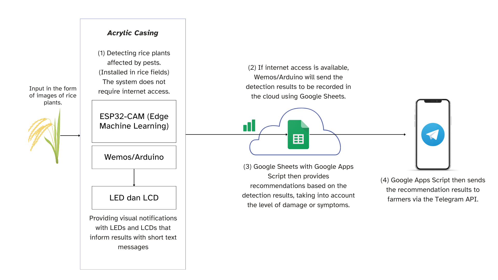

# Edge-Computing-IoT-Rice-Plant-Disease
"Rice diseases like **brown spot, tungro, and blight** threaten yields in Indonesia. This research develops an IoT edge system using ESP32-CAM for local/online detection. With a CNN model (92.73% accuracy), it classifies four conditions, shows results via LCD/LED, logs to Google Sheets, and offers action recommendations for farmers."

## Features
- Offline & online detection (Edge + Cloud)
- Local output via **LCD & LED indicators**
- Cloud logging to **Google Sheets**
- YOLO-based classification (4 classes, ~92.73% accuracy)
- Simple action recommendations for farmers

## System Overview

## Getting Started
1. Flash firmware to ESP32-CAM & Wemos
2. Connect hardware based on wiring in `/hardware`
3. Run Google Apps Script in `/cloud`
4. Power on device and monitor results via LCD/LED

## Results
- Test Accuracy: **92.73%**
- Avg Inference Time: **~1743 ms**
- Memory usage within ESP32-CAM limits
- Field tested in real paddy plots

## License
This project is released under the [MIT License](LICENSE).
